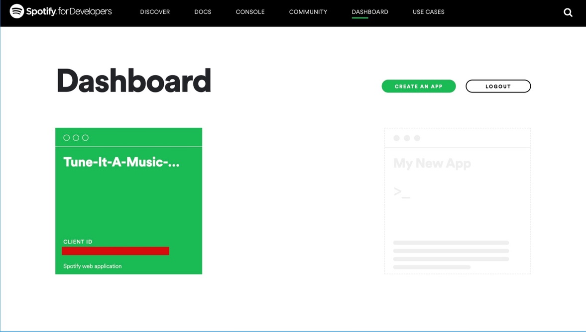
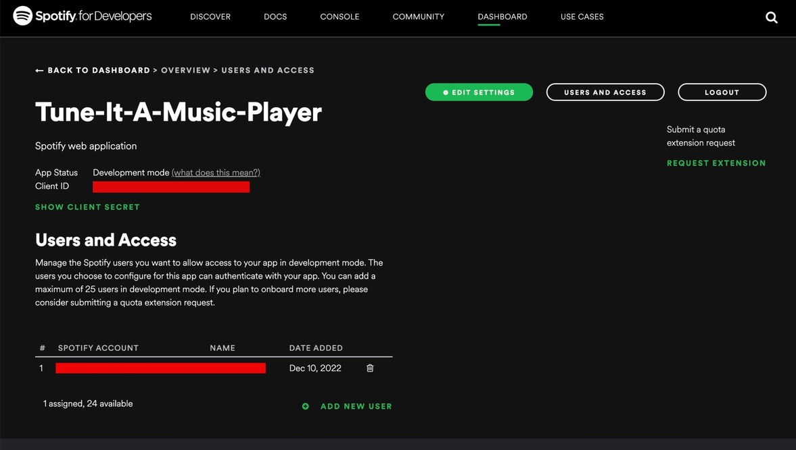

# What to Learn for contributing to Tune-It-A-Music-Player 

### Firstly - 
* Create a basic template of a music website:
    * NavBar
    * Search Bar to search for tracks
    * Component to display User Devices
    ```html
        <div class="device-cont">
            <select name="" id="devices">
                    // option tags with each user device
            </select>
        </div>
    ```
    * User Profile Page with components like:
    ```html
        <div class="user_info">
             // for user image
            <div class="side_info">
                PROFILE
                <h1 class="profile_name" id="profile_name"></h1> // for user name
            </div>
        </div>
    ```
    * Component to display top songs
    ```html
        <div class="pop_song" id="liked-songs">
            <!-- <li class="songItem">
                <div class="img_play">
                    
                    <i class="bi playListPlay bi-play-circle-fill" id="7"></i>
                </div>
                <h5>On My Way
                    <br>
                    <div class="subtitle">Alan Walker</div>
                </h5>
            </li> -->
        </div>
    ```
    * Component to display top artists
    ```html
        <div class="item" id="fav-artists">
            <!-- <li>
                
                <div class="subtitle">Alan Walker</div>
            </li> -->
            <!-- change all img  -->
        </div>
    ```
> You can follow [this](https://youtu.be/OafpiyPa63I) link for making a basic template of your music website.

### After you are done with this,
### You can start working with the Spotify API.

1. Go to the **[Spotify Developers Page](https://developer.spotify.com/)**
2. Click on **Dashboard**
3. **Log In** if you have an account, **Sign Up** if you don't.
4. After you're Logged In, click on **CREATE AN APP**, fill in the necessary details and click on **CREATE**
5. You'll see a page like this
   
6. Click on your App, and now you'll be able to see something like this
    
7. Now, the most important steps are:
    * Click on **USERS AND ACCESS** and then click on **ADD NEW USER**. Fill in the details.
    * After finishing this, click on **EDIT SETTINGS** and set the value of *REDIRECT_URI* as the URI of your Music Player HTML Page. In Tune-It-A-Music-Player, the page is *index.html* and the URI is *http://127.0.0.1:5500/index.html*

Now, you can use the **CLIENT_ID** and **CLIENT_SECRET** for fetching data.

* You'll have to make an authentication page wherein the user can enter his/her CLIENT_ID and CLIENT_SECRET, then send an authorization request to Spotify.

* After Spotify authorizes the user, they'll be redirected to the **REDIRECT_URI** which is the Music Player.

* **You can follow [this](https://youtu.be/1vR3m0HupGI) YouTube tutorial to get some idea about the authorization process.**

* After you're done with this, now you can start fetching your TOP TRACKS, TOP/FOLLOWED ARTISTS, USER INFORMATION, ALBUMS, PLAYLISTS, RECOMMENDATIONS, RECENTLY PLAYED and many other things. **Check out [this](https://developer.spotify.com/documentation/web-api/reference/#/) page for all the URIs you can use to fetch different data.**

* You can also log the fetched data to the console to see all the different parameters in it.

Now, you can show the fetched data on screen.

For example :-<br/>
> Show User Devices
```js
var data_devices = JSON.parse(this.responseText);
console.log(data_devices);
const devices = document.getElementById('devices');
data_devices.devices.forEach( device_ => {
    let node = document.createElement('option');
    node.value = device_.id;
    node.innerHTML = device_.name;
    devices.appendChild(node);
})
```
<br/>

> Show User Info
```js
var data_user = JSON.parse(this.responseText);
console.log(data_user);
const userimg = document.getElementById('userimg');
const username = document.getElementById('username');
const profileimg = document.getElementById('profile_img');
const profilename = document.getElementById('profile_name');
profileimg.src = data_user.images[0].url;
profilename.textContent = data_user.display_name;
userimg.src = data_user.images[0].url;
username.textContent = data_user.display_name;
```
<br/>

> Show top tracks
```js
const container = document.getElementById('liked-songs');
let adder = '';
data_toptracks.items.forEach( song_ => {
    adder+=`<li class="songItem">
                <div class="img_play">
                    
                    <i class="bi playListPlay bi-play-circle-fill" id="${song_.id}" onclick="songClick('${song_.id}')"></i>
                </div>
                <h5>${song_.name}
                    <br>
                    <div class="subtitle">${song_.artists[0].name}</div>
                </h5>
            </li>`
})
container.innerHTML = adder;
```
<br/>

> Show top artists
```js
var data_topartist = JSON.parse(this.responseText);
console.log(data_topartist);
const bgimg = document.getElementById('cover-img');
bgimg.src = `${data_topartist.tracks[0].album.images[0].url}`;
const top_artist_song = document.getElementById('top-artist-song');
top_artist_song.textContent = data_topartist.tracks[0].album.artists[0].name + ' - ' + data_topartist.tracks[0].name ;
const date = document.getElementById('release_date');
date.textContent = data_topartist.tracks[0].album.release_date;
```
<br/>

And similarly, modify many other things.

**Contribute well 🚀**